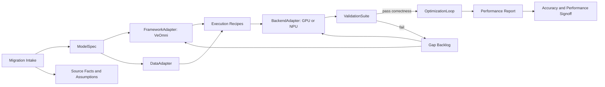

# Phase 1: VeOmni + MiniMax M3 Intake - Research

**Researched:** 2026-06-15
**Domain:** AI framework/model migration, distributed training, accelerator portability
**Confidence:** MEDIUM

<user_constraints>
## User Constraints (from CONTEXT.md)

### Locked Decisions
- Design a framework for recurring AI Infra migration work across algorithms, models, datasets, training/inference features, GPU/NPU portability, performance tuning, and accuracy signoff.
- Use VeOmni + MiniMax M3 as the first vertical slice.
- Treat correctness, accuracy, and performance evidence as migration completion criteria.
- Publish this repository under GitHub owner `Kirrito-k423`, repository `AutoModelMigrate`.
- Accumulate Ascend NPU runtime setup knowledge into a reusable Codex skill covering CANN, PTA/torch_npu, `npu-smi`/DCMI, and verification gates.

### Claude's Discretion
- Choose the first vertical slice based on evidence.
- Evolve artifact and schema names during architecture design.

### Deferred Ideas (OUT OF SCOPE)
- Portfolio dashboarding.
- Deep vendor kernel implementation before semantic correctness.
- Broad multi-model generalization before MiniMax M3 is understood.
</user_constraints>

<architectural_responsibility_map>
## Architectural Responsibility Map

| Capability | Primary Tier | Secondary Tier | Rationale |
|------------|-------------|----------------|-----------|
| Model architecture representation | ModelSpec | FrameworkAdapter | Captures model semantics independent of framework mechanics. |
| VeOmni integration | FrameworkAdapter | Recipe | VeOmni-specific hooks should translate generic specs into framework code/config. |
| GPU/NPU execution | BackendAdapter | OptimizationLoop | Backend capabilities and profiler evidence drive portability and tuning. |
| Ascend NPU runtime readiness | BackendAdapter | Project operations docs | CANN/PTA setup and DCMI verification must be proven before VeOmni NPU recipes are meaningful. |
| Dataset/tokenizer/checkpoint parity | DataAdapter | ValidationSuite | Migration success depends on identical inputs and checkpoint interpretation. |
| Correctness and accuracy gates | ValidationSuite | Recipe | Gates must be reproducible and attached to migration lifecycle states. |
| Performance tuning | OptimizationLoop | BackendAdapter | Tuning starts after correctness and records backend-specific evidence. |
</architectural_responsibility_map>

<research_summary>
## Summary

VeOmni is publicly described as a versatile framework for single- and multi-modal pre-training and post-training, designed around modularity, model-centric distributed recipes, flexible configuration, and accelerator scaling. Its paper and documentation emphasize decoupling model definition from communication/distributed logic, composable recipes, and support for large omni-modal training.

MiniMax M3 is a very recent model release dated 2026-06-01. Public MiniMax material describes it as an open-weight frontier model with coding, 1M-token context, native multimodality, and MiniMax Sparse Attention (MSA). This makes M3 a strong first case because it stresses attention implementation, long-context memory planning, multimodal data contracts, checkpoint/tokenizer compatibility, and backend-specific performance.

**Primary recommendation:** Make Phase 1 an intake/gap phase, not an implementation phase. The first vertical slice should likely prove M3 config/checkpoint/tokenizer/model-construction parity and a tiny forward or inference path in VeOmni before attempting distributed training or NPU optimization.

**NPU recommendation:** Treat Ascend NPU setup as a separate readiness lane in Phase 1. The current machine has partial driver artifacts but is not ready for framework execution: `npu-smi info` fails at DCMI initialization, CANN toolkit is not present under `/usr/local/Ascend/ascend-toolkit`, and `torch`/`torch_npu` are not installed. This should block NPU smoke execution until driver/DCMI, CANN, and PTA gates pass.
</research_summary>

<standard_stack>
## Standard Stack

### Core
| Component | Purpose | Why Standard |
|-----------|---------|--------------|
| Migration manifest | Declare source/target/model/backend/data/validation dimensions | Makes each migration inspectable and reproducible. |
| Capability matrix | Record supported/missing/emulated/optimized features | Prevents hidden GPU/NPU and framework assumptions. |
| Adapter interfaces | Isolate framework, backend, model, and data integration | Keeps one migration from contaminating the next. |
| Validation recipes | Run smoke, parity, accuracy, and performance gates | Converts migration quality into evidence. |
| Profiling reports | Record bottlenecks and before/after tuning results | Makes optimization scientific rather than anecdotal. |

### Supporting
| Component | Purpose | When to Use |
|-----------|---------|-------------|
| Assumption log | Track facts vs unknowns for new models | Required for recent models with incomplete public details. |
| Gap backlog | Prioritize missing ops/adapters/kernels/data features | Created after intake before implementation. |
| Golden fixtures | Stable small inputs/checkpoints/outputs | Used for correctness gates and regression tests. |
| Ascend NPU runtime skill | Capture CANN/PTA install, `npu-smi` checks, environment activation, and evidence templates | Required before claiming VeOmni + MiniMax M3 can run on NPU. |
</standard_stack>

<current_npu_host>
## Current Ascend NPU Host Evidence (2026-06-16)

| Check | Result | Interpretation |
|-------|--------|----------------|
| CPU architecture | `aarch64` | Install matrix must use aarch64-compatible wheels/images. |
| Driver path | `/usr/local/Ascend/driver` exists | Driver artifacts are present. |
| Driver version | `25.5.2`; `ascendhal_version=7.35.23`; compatible firmware `[7.0.0,8.9.9]` | Record as the lower-layer version constraint. |
| `npu-smi` path | `/usr/local/sbin/npu-smi` | CLI exists. |
| `npu-smi info` | Fails: `dcmi module initialize failed. ret is -8005` | Driver/DCMI/device layer is not usable yet. |
| CANN toolkit | `/usr/local/Ascend/ascend-toolkit` missing; `set_env.sh` missing | CANN toolkit gate is not satisfied. |
| Environment variables | `ASCEND_HOME_PATH`, `ASCEND_TOOLKIT_HOME`, `LD_LIBRARY_PATH`, `PYTHONPATH` empty | Runtime activation has not happened in this shell. |
| Python stack | Python 3.10.12 present; `torch` and `torch_npu` missing | PTA/torch_npu gate is not satisfied. |
| Skill created | `$HOME/.codex/skills/ascend-npu-runtime` | Reusable NPU setup/verification workflow exists for future sessions. |

Readiness classification from the skill inspector: `driver-broken`.
</current_npu_host>

<ascend_runtime_stack>
## Ascend Runtime Stack Guidance

The install and verification path should be layered:

1. Driver/DCMI: `npu-smi info` must succeed before Python work is useful.
2. CANN toolkit/kernels: install versions compatible with the driver branch and source `set_env.sh`.
3. PyTorch + PTA/torch_npu: install only from a documented PyTorch/CANN/torch_npu compatibility matrix.
4. Framework smoke: run the smallest VeOmni recipe only after gates 1-3 pass.
5. Model smoke: run MiniMax M3 construction/forward smoke only after the framework can see the NPU.

Official Ascend PyTorch guidance documents CANN toolkit, firmware/driver, and environment variables as prerequisites for NPU execution. The Ascend PyTorch adapter repository also treats CANN as a prerequisite before `torch_npu`. vLLM Ascend's install guide gives practical container pass-through patterns for `/dev/davinci*`, `npu-smi`, and driver library mounts; use those as a pattern when this project runs inside Docker.
</ascend_runtime_stack>

<architecture_patterns>
## Architecture Patterns

### System Architecture Diagram



### Recommended Project Structure

```text
docs/
  framework/
    architecture.md
    migration-manifest.schema.md
    capability-matrix.md
    validation-suite.md
    optimization-loop.md
  cases/
    veomni-minimax-m3/
      intake.md
      assumptions.md
      gap-analysis.md
      validation-plan.md
      performance-plan.md
src/
  automigrate/
    specs/
    adapters/
    recipes/
    validation/
    optimization/
```

### Pattern 1: Capability-First Backend Design
**What:** Backends declare features and constraints before adapters use them.
**When to use:** GPU/NPU portability, sparse attention support, precision policy, communication features.

### Pattern 2: Goal-Backward Validation
**What:** Define required evidence before implementation starts.
**When to use:** Any migration where accuracy and performance matter.

### Pattern 3: Case-Derived Abstractions
**What:** Build the generic framework from one hard case, then extract stable interfaces.
**When to use:** Avoiding premature generic design in AI infra.
</architecture_patterns>

<dont_hand_roll>
## Don't Hand-Roll

| Problem | Don't Build | Use Instead | Why |
|---------|-------------|-------------|-----|
| Distributed training orchestration | New scheduler/trainer runtime | VeOmni recipes and existing infra schedulers | Scope control and reliability. |
| Benchmark tracking | Ad hoc notes in chat | Versioned validation/performance report files | Needed for signoff and regression tracking. |
| Backend feature branching | If/else spread across model code | Capability descriptors and backend adapters | Enables GPU/NPU portability. |
| Accuracy confidence | One sample output | Golden fixtures plus task-level evals | Reduces false positives. |
</dont_hand_roll>

<common_pitfalls>
## Common Pitfalls

### Pitfall 1: Runnable But Wrong
**What goes wrong:** Model code executes but tokenizer, checkpoint, precision, attention mask, or data formatting differs from baseline.
**How to avoid:** Require parity fixtures and drift thresholds before performance work.

### Pitfall 2: Backend Forking
**What goes wrong:** GPU and NPU support diverge into separate model implementations.
**How to avoid:** Use backend capability descriptors and isolate backend-specific logic.

### Pitfall 3: Optimizing Before Semantics
**What goes wrong:** Profiling and kernels are tuned before correctness is proven.
**How to avoid:** Lock lifecycle gates: correctness first, then scale, then optimize.

### Pitfall 4: Recent Model Assumptions
**What goes wrong:** Public model details are incomplete or change quickly.
**How to avoid:** Keep source links, dates, and explicit assumptions in the case dossier.
</common_pitfalls>

<sota_updates>
## State of the Art (2026)

| Topic | Current Signal | Impact |
|-------|----------------|--------|
| VeOmni | Public docs and paper emphasize model-centric distributed recipes and any-modality scaling | Good fit for framework migration research. |
| MiniMax M3 | Released 2026-06-01 with 1M context, native multimodality, and MSA sparse attention claims | First case must include sparse/long-context/multimodal dimensions. |
| vLLM-style serving | Public discussions indicate sparse attention backend support can lag model releases | Inference portability should treat attention backend support as a gap category. |
| NVIDIA Dynamo/TensorRT-LLM | Recent NVIDIA material discusses MiniMax M3 deployment using Dynamo and TensorRT-LLM | Performance planning should compare VeOmni path with known inference-serving baselines when relevant. |
</sota_updates>

<open_questions>
## Open Questions

- Are MiniMax M3 open weights and full architecture implementation available in the public repository yet?
- Is the first VeOmni slice intended to be pre-training, post-training, fine-tuning, or inference enablement?
- Which NPU target matters first: Ascend, another vendor, or an internal backend?
- For the current Ascend host, is the DCMI failure caused by host driver state, permissions, container pass-through, or unsupported hardware access in this session?
- Which CANN/PTA matrix should be pinned for VeOmni: latest stable Ascend PyTorch, a framework-provided image, or an internal platform baseline?
- What accuracy baseline should MiniMax M3 parity compare against: official outputs, HF implementation, vendor inference stack, or existing internal implementation?
- What is the minimum acceptable long-context length for the first slice: tiny smoke, 32K, 128K, or full 1M?
</open_questions>

<sources>
## Sources

- VeOmni GitHub: https://github.com/ByteDance-Seed/VeOmni
- VeOmni docs: https://veomni.readthedocs.io/en/latest/
- VeOmni paper page: https://arxiv.org/html/2508.02317v3
- MiniMax M3 announcement: https://www.minimax.io/blog/minimax-m3
- NVIDIA MiniMax M3 deployment article: https://developer.nvidia.com/blog/deploy-long-context-reasoning-and-agentic-workflows-with-minimax-m3-on-nvidia-accelerated-infrastructure/
- vLLM MiniMax M3 support discussion: https://discuss.vllm.ai/t/minimax-m3-support/2689
- Ascend PyTorch install guide: https://ascend.github.io/docs/sources/pytorch/install.html
- Ascend PyTorch adapter repository: https://github.com/Ascend/pytorch
- vLLM Ascend install guide: https://docs.vllm.ai/projects/ascend/en/v0.7.1/installation.html
- Ascend PyTorch model porting guide: https://gitee.com/ascend/pytorch/blob/master/docs/en/PyTorch%20Network%20Model%20Porting%20and%20Training%20Guide/PyTorch%20Network%20Model%20Porting%20and%20Training%20Guide.md
</sources>
