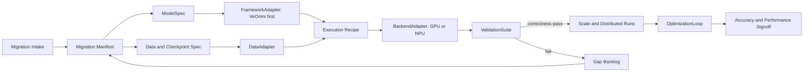

# Architecture Research

**Domain:** AI infrastructure migration framework
**Researched:** 2026-06-16
**Confidence:** MEDIUM

## Standard Architecture

### System Overview



### Component Responsibilities

| Component | Responsibility | Typical Implementation |
|-----------|----------------|------------------------|
| Migration Manifest | Declares source/target framework, model, backend, data, checkpoint, precision, validation gates | JSON/YAML with schema validation. |
| ModelSpec | Captures model semantics independent of framework | Python typed objects plus serialized manifest sections. |
| FrameworkAdapter | Maps ModelSpec and recipes into a specific framework | VeOmni adapter first; later adapters for other frameworks. |
| BackendAdapter | Describes GPU/NPU capabilities and constraints | Capability descriptors plus runtime hooks. |
| DataAdapter | Ensures tokenizer, dataset, preprocessing, and checkpoint parity | Fixtures, converters, and parity tests. |
| ValidationSuite | Blocks status transitions until evidence exists | pytest suites, eval runners, reports. |
| OptimizationLoop | Turns profiler evidence into tracked performance changes | Performance plans, reports, rollback criteria. |

## Recommended Project Structure

```text
docs/
  framework/
    architecture.md
    migration-manifest.schema.md
    capability-matrix.md
    validation-suite.md
    optimization-loop.md
  cases/
    veomni-minimax-m3/
      intake.md
      assumptions.md
      gap-analysis.md
      validation-plan.md
      performance-plan.md
src/
  automigrate/
    specs/
    adapters/
      frameworks/
      backends/
      data/
    recipes/
    validation/
    optimization/
tests/
  fixtures/
  parity/
  integration/
```

## Architectural Patterns

### Pattern 1: Capability-First Backends

**What:** Backends declare supported, unsupported, emulated, native, and optimized features.
**When to use:** GPU/NPU migration, precision policy, sparse attention kernels, collective communication.
**Trade-offs:** More upfront schema work, much less hidden branching.

### Pattern 2: Goal-Backward Validation

**What:** Define observable truths before implementation starts.
**When to use:** Any model/framework migration where accuracy and performance matter.
**Trade-offs:** Slower kickoff, faster signoff and fewer late surprises.

### Pattern 3: Case-Derived Abstractions

**What:** Extract generic contracts from MiniMax M3 + VeOmni rather than designing only abstractly.
**When to use:** New infra frameworks where real edge cases should shape the architecture.
**Trade-offs:** First case gets more design load, later migrations get better templates.

## Data Flow

1. **Intake flow:** User/project facts -> Migration Manifest -> Gap Backlog.
2. **Implementation flow:** ModelSpec/DataSpec -> FrameworkAdapter/DataAdapter -> Recipe -> BackendAdapter.
3. **Validation flow:** Recipe outputs -> ValidationSuite -> status transition or gap.
4. **Optimization flow:** Backend profile -> hypothesis -> change -> performance report -> signoff.

## Sources

- VeOmni paper: https://arxiv.org/html/2508.02317v3
- VeOmni docs: https://veomni.readthedocs.io/en/latest/
- MiniMax Sparse Attention paper: https://arxiv.org/html/2606.13392v1

---
*Architecture research for: AI Infra Migration Framework*
*Researched: 2026-06-16*
